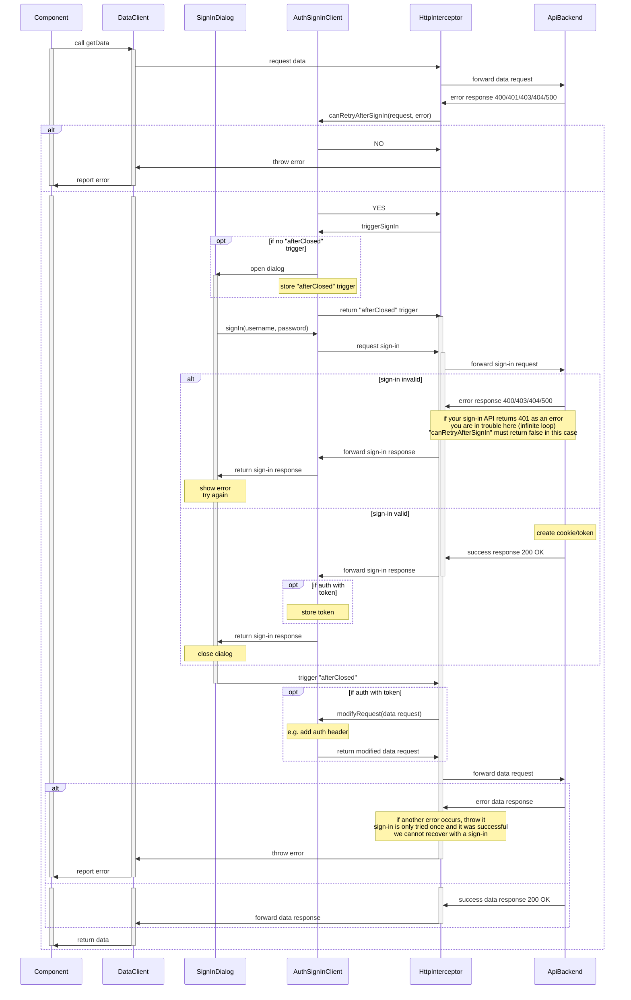

# @flens-dev/tools/auth

## HttpInterceptor with Sign-In Dialog

If an HTTP request errors with a "401 Unauthorized" it can be retried after a successful sign-in.

An `HttpInterceptorFn` can be used to detect such an error.
It can show a dialog to the user to enter the credentials and then retry the request.
The calling component/data-client is not affected, it only takes longer to fullful the request.

### The Flow

- The interceptor catches an error from the backend.
- It asks the `AuthSignInClient.canRetryAfterSignIn` if it can recover from this error after a sign-in.
- If it's an error unrelated to authorization the interceptor rethrows the error to the `DataClient`.
- Otherwise the `AuthSignInClient` is triggered to show the sign-in dialog.
- It will only open the dialog once, but always returns the "afterClosed" trigger (using Angular Material semantics here).
- The interceptor uses this trigger to chain another call with the original HTTP request.
- After the user entered the credentials, the sign-in dialog sends the sign-in request to the backend.  
  **Beware:** This is also an HTTP request, so it will enter the interceptor, too!
  If the sign-in API returns a "401 Unauthorized" you may end up in an infinite loop.
  The `canRetryAfterSignIn` should return "NO" in this case.
- After successfully signing in, the "afterClosed" trigger emits once and completes, which triggers resending the HTTP request.  
  **Note:** If you're using a bearer token for authentication, you have to add that to the original HTTP request.
  You can ask the `AuthSignInClient.modifyRequest` to do it for you.
  If you're using cookie based authentication, you can skip this step.
- If there's still an error when sending this request, it will be thrown to the `DataClient`.
  Signing in is only tried once.
- Otherwise on success the response is returned to the `DataClient` which then passes it through to the component.

### Usage with Angular Material

- Create your `FooAuthSignInClient` which extends the [`MaterialDialogAuthSignInClient`](./src/material-dialog/material-dialog-auth-sign-in.client.ts).
- Implement the `signIn` method to integrate with your authentication backend.
- Optionally override the `modifyRequest` method, e.g. if you need to add a bearer token.
- Register the [`authSignInInterceptor`](./src/auth-sign-in.interceptor.ts) with the `HttpClient` in your application's configuration.  
  `provideHttpClient(withInterceptors([authSignInInterceptor]))`
- Provide your `FooAuthSignInClient` on the application's configuration.  
  [`provideMaterialDialogAuthSignIn(FooAuthSignInClient)`](./src/material-dialog/provide-material-dialog-auth-sign-in.ts)

### Usage with alternative dialogs

Inspect the [`MaterialDialogAuthSignInClient`](./src/material-dialog/material-dialog-auth-sign-in.client.ts)
and reimplement it with whatever you need.
Also provide a similar function to [`provideMaterialDialogAuthSignIn`](./src/material-dialog/provide-material-dialog-auth-sign-in.ts)
for registering it in the dependency injection container.
