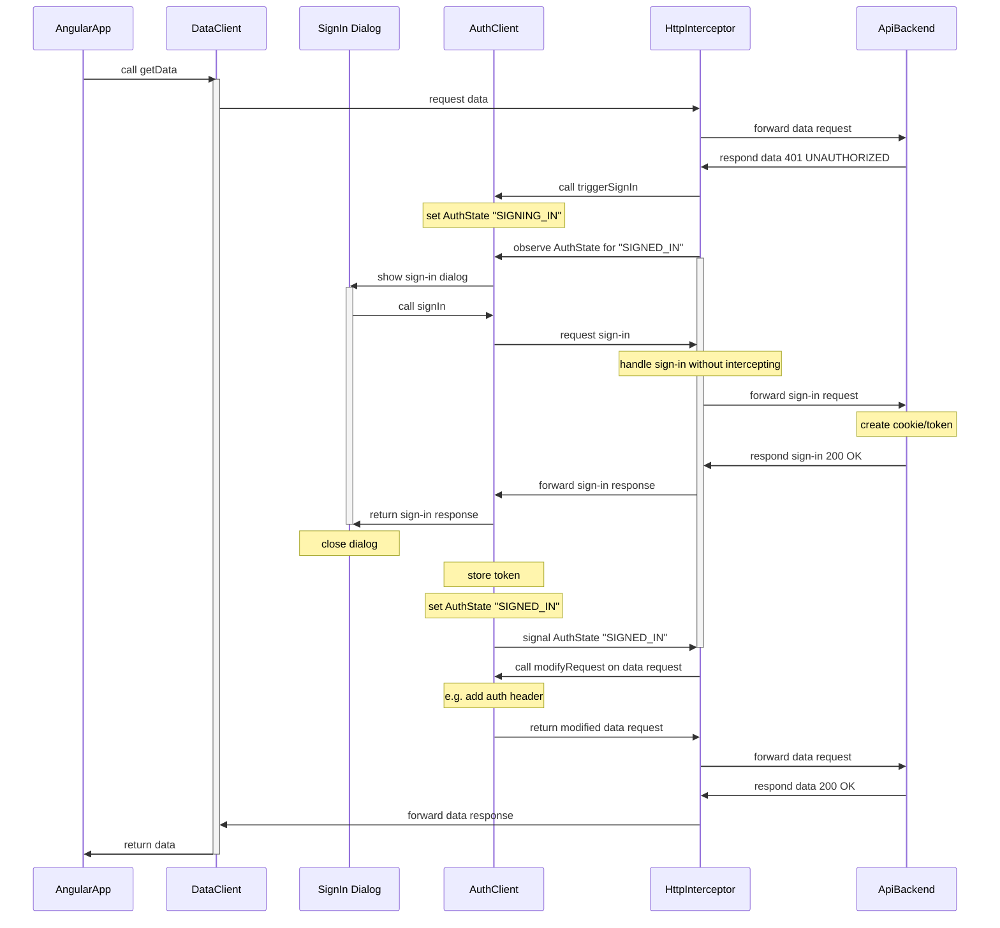

# @flens-dev/tools/auth

```mermaid
sequenceDiagram
  participant A as AngularApp
  participant D as DataClient
  participant L as SignIn Dialog
  participant S as AuthClient
  participant H as HttpInterceptor
  participant B as ApiBackend

  A->>D: call getData
  activate D
  D->>H: request data
  H->>B: forward data request
  B->>H: respond data 401 UNAUTHORIZED
  H->>S: call triggerSignIn
  Note over S: set AuthState "SIGNING_IN"
  H->>S: observe AuthState for "SIGNED_IN"
  activate H
  S->>L: show sign-in dialog
  activate L
  L->>S: call signIn
  S->>H: request sign-in
  Note over H: handle sign-in without intercepting
  H->>B: forward sign-in request
  Note over B: create cookie/token
  B->>H: respond sign-in 200 OK
  H->>S: forward sign-in response
  S->>L: return sign-in response
  deactivate L
  Note over L: close dialog
  Note over S: store token
  Note over S: set AuthState "SIGNED_IN"
  S->>H: signal AuthState "SIGNED_IN"
  deactivate H
  H->>S: call modifyRequest on data request
  Note over S: e.g. add auth header
  S->>H: return modified data request
  H->>B: forward data request
  B->>H: respond data 200 OK
  H->>D: forward data response
  D->>A: return data
  deactivate D
```
